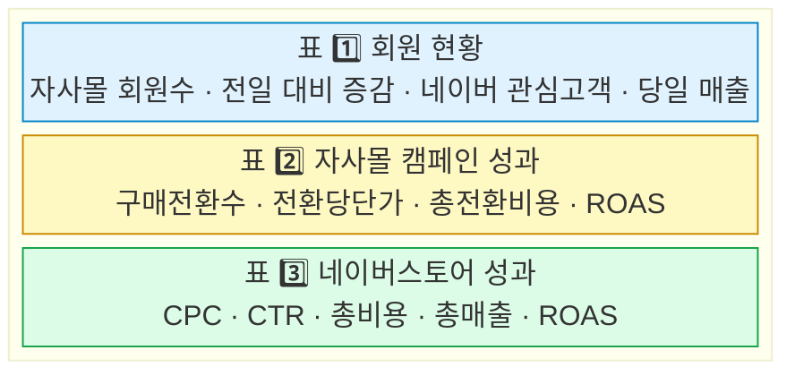

# 📊 일간 마케팅 대시보드

> **한 줄 요약:** 광고 데이터(CSV/Excel)를 넣으면, 소재별 성과(ROAS·회원수·매출)를 자동 계산해서 한눈에 보여주는 도구입니다.

**누가 쓰나요?** 마케팅 담당자, 퍼포먼스 마케터, 경영진 등 매일 아침 광고 성과를 빠르게 확인하고 싶은 분
**왜 쓰나요?** 엑셀에서 수식 만들고 정리하는 시간 없이, 데이터만 넣으면 바로 대시보드가 완성됩니다
**언제 쓰나요?** 매일 아침 전일 광고 성과를 확인할 때

---

## 한눈에 보는 흐름


**쉽게 말하면:** 데이터 파일을 넣으면 → 알아서 계산해서 → 예쁜 표로 보여줍니다.

---

## 대시보드에서 볼 수 있는 것



| 표 | 어떤 정보를 보여주나요? |
|:---:|---|
| **표 1** | 우리 회원이 얼마나 늘었나? 어제보다 매출이 올랐나? |
| **표 2** | 자사몰 광고가 돈 대비 얼마나 효과가 있었나? |
| **표 3** | 네이버스토어 광고는 클릭당 얼마이고, 수익률은 어떤가? |

> 🟢 **숫자가 초록색** = 어제보다 올랐어요 (좋은 신호)
> 🔴 **숫자가 빨간색** = 어제보다 내렸어요 (확인 필요)

---

## 시작하는 방법

### 1단계: 프로그램 설치 (처음 한 번만)

```bash
pip install -r requirements.txt
```

> 💡 `pip`이 뭔지 모르겠다면, 개발팀에 "Python 환경 세팅해주세요"라고 요청하세요.

### 2단계: 대시보드 열기

```bash
streamlit run app.py
```

실행하면 웹 브라우저에 대시보드가 자동으로 열립니다.

### 3단계: 데이터 넣기

왼쪽 사이드바에서 아래 3가지 중 하나를 선택하세요:

| 방법 | 설명 | 추천 상황 |
|:---:|---|---|
| **샘플 데이터** | 미리 준비된 예제 데이터로 테스트 | 처음 써볼 때 |
| **파일 업로드** | CSV 또는 Excel 파일을 직접 올리기 | 매일 사용할 때 |
| **복사 붙여넣기** | Excel에서 Ctrl+C → 대시보드에 Ctrl+V | 빠르게 확인할 때 |

---

## 데이터 준비 방법

### 입력 1: 회원 현황 파일

| 컬럼 이름 | 뜻 | 예시 |
|---|---|---|
| 날짜 | 데이터 기준 날짜 | 2026-03-15 |
| 자사몰 회원수 | 현재 총 회원 수 | 12,905 |
| 네이버 관심고객 증감율(%) | 네이버에서 우리를 찜한 고객의 변화율 | 1.8 |
| 자사몰 당일 매출 | 그날 자사몰 총 매출 | 7,120,000 |

### 입력 2: 네이버 광고 파일

| 컬럼 이름 | 뜻 | 예시 |
|---|---|---|
| 날짜 | 데이터 기준 날짜 | 2026-03-15 |
| 상품명 | 광고한 상품 이름 | 스킨케어 세트 |
| 구매전환수 | 광고를 보고 실제 구매한 횟수 | 23 |
| 전환당단가 | 구매 1건을 만드는 데 든 광고비 | 4,500 |
| 총전환비용 | 구매 전환에 쓴 총 비용 | 103,500 |
| 총비용 | 이 광고에 쓴 전체 비용 | 150,000 |
| CPC | 클릭 1회당 비용 (Cost Per Click) | 320 |
| 총구매전환매출 | 광고로 발생한 총 매출 | 1,200,000 |
| CTR(%) | 광고를 본 사람 중 클릭한 비율 (Click Through Rate) | 2.3 |

> 💡 **ROAS**는 직접 입력할 필요 없습니다. 대시보드가 자동으로 계산합니다.
> ROAS = 광고로 번 매출 ÷ 광고비 × 100 (높을수록 좋아요!)

---

## 파일 구조

```
NDA/
├── app.py                  # 대시보드 프로그램
├── requirements.txt        # 필요한 소프트웨어 목록
├── sample_data/
│   ├── members.csv         # 회원 현황 예제
│   └── naver_ads.csv       # 광고 데이터 예제
└── README.md               # 지금 보고 있는 이 문서
```
